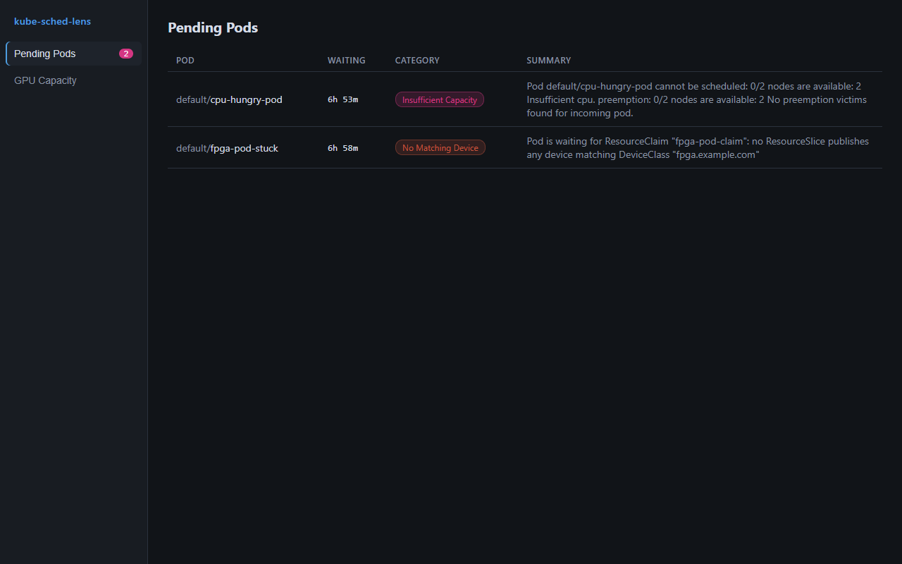
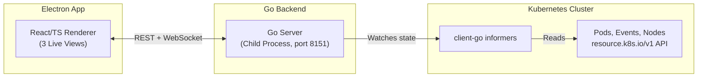

# kube-sched-lens

<div align="center">
  <p><strong>A desktop debugger for GPU/accelerator scheduling on Kubernetes with Dynamic Resource Allocation (DRA).</strong></p>
  
  [](https://opensource.org/licenses/Apache-2.0)
  [](https://kubernetes.io)
  [](https://www.electronjs.org/)
</div>

---

When a Pod that requests a GPU sits in `Pending`, the answer is often scattered across four distinct `resource.k8s.io/v1` objects (`DeviceClass`, `ResourceSlice`, `ResourceClaim`, `ResourceClaimTemplate`), scheduler events, and node capacities. 

**kube-sched-lens** brings all of this information together in real-time. It provides a straightforward diagnosis for scheduling failures—summarized in one sentence—with all the supporting evidence attached.



## Key Features

- **Live Pending Pods Table:** Instantly view every `Pending` pod categorized by diagnosis: 
  `unallocated-claim`, `no-matching-device`, `insufficient-capacity`, `taint`, `affinity`, or `unknown`.
- **Intelligent Diagnosis:** Each pod gets a clear, one-sentence summary explaining exactly why it's pending, an actionable suggestion, and a complete evidence trail (including scheduler events, claim allocation status, and matching/missing `ResourceSlice` devices).
- **GPU Capacity Inventory:** Get a detailed per-driver, per-pool, and per-node device inventory derived from `ResourceSlices`, comparing allocated versus free counts based on active `ResourceClaims`.
- **Real-time Streaming:** Updates stream instantly over WebSockets via client-go informers. No manual polling or slow `kubectl` round-trips!

## Architecture

The app is built using a modern decoupled architecture:



- **Backend (Go):** client-go informers maintain a live in-memory index. The diagnosis engine cross-references `FailedScheduling` events with claim allocation states and slice inventory.
- **Frontend (Electron + Vite + React/TS):** Spawns the backend as a lightweight child process and beautifully renders the live state.

## Quickstart

### Demo Mode (No Cluster Needed)

Want to see it in action without a cluster? We've got a demo mode configured with fixtures modeled on a kind cluster running the upstream [dra-example-driver](https://github.com/kubernetes-sigs/dra-example-driver), including a deliberately stuck, unallocatable `ResourceClaim`.

```bash
# Terminal 1: Run the backend in demo mode
go run ./cmd/kube-sched-lens --demo

# Terminal 2: Start the frontend dev server
cd app
npm install
npm run dev
```

### Real Cluster Mode

_Requires Kubernetes ≥ 1.34 (DRA GA, `resource.k8s.io/v1`)._

```bash
# Terminal 1: Run against your active kubeconfig
go run ./cmd/kube-sched-lens

# Terminal 2: Start the frontend dev server
cd app
npm run dev
```

## Development

Running tests for the diagnosis engine:
```bash
go test ./...
```

Building the production Electron app:
```bash
cd app
npm run build
```

## Motivation

Built while preparing a proposal for the LFX mentorship: [*Adding Dynamic Resource Allocation (DRA) to Headlamp*](https://github.com/kubernetes-sigs/headlamp). This served as a from-scratch exploration of the same problem space: making the massive DRA object graph easily navigable and debuggable for humans.

## License

Licensed under [Apache-2.0](LICENSE).
